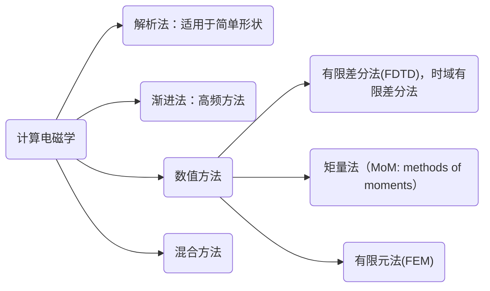

# 计算电磁学 Computational Electromagnetics

常用软件：**HFSS, FEKO, ADS**

厉害的人： 周永祖 W.C.chew ；金建铭

参考书目：
- JA.stratton 电磁理论
- RF.Harrington 正弦电磁场
- 渐进法
    - 院颖铮 《雷达界面与隐身技术》
    - 黄培康 《雷达目标特性》
- 数值方法
    - M.N.O Sadiku. Numerical Techniques in Electromagnetics
    - T.Itoh. Numerical Techniques For Microwave and MM-wave Passive Structres
    - 王长清 《现代计算电磁学基础》
    - 盛新庆 《计算电磁学要论》
- FDTD相关
  - Allen Taflove, Susan C. Hangness. Computational Electrodynamics-The Finite -Difference Time-Domain Method, Third Edition
  - 王长清 《电磁计算中的时域有限差分法》
  - 高本庆 《时域有限差分法FDTD Method》
  - 葛德彪，闫玉波 《电磁学时域有限差分法》
  - 王秉中 《计算电磁学》
- MOM相关
  - 哈林登 计算电磁学的矩量法
- FEM相关
  - P.P Silvester 有限元在电气工程中的应用 Finite Elements for Electrical Engineers
  - 金建铭 《电磁场有限元方法》