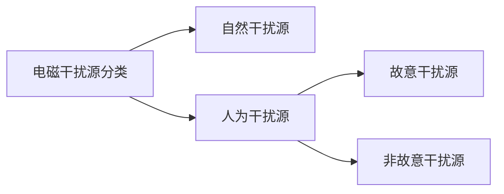

# 电磁干扰信号分类

## 按照频率来分
1. 工频干扰：50Hz
2. 低频干扰：30KHz
3. 载频干扰：10-300KHz
4. 射频干扰：300k-300MHz
5. 微波干扰：300M-300GHz
6. 雷电以及核磁干扰，范围很宽

## 按源来分类

```mermaid
flowchart LR
id_root["电磁干扰源分类"]
id_child1["自然干扰源"]
id_child2["人为干扰源"]
id_child2_1["故意干扰源"]
id_child2_2["非故意干扰源"]
id_root --> id_child1
id_root --> id_child2
id_child2 --> id_child2_1
id_child2 --> id_child2_2
```