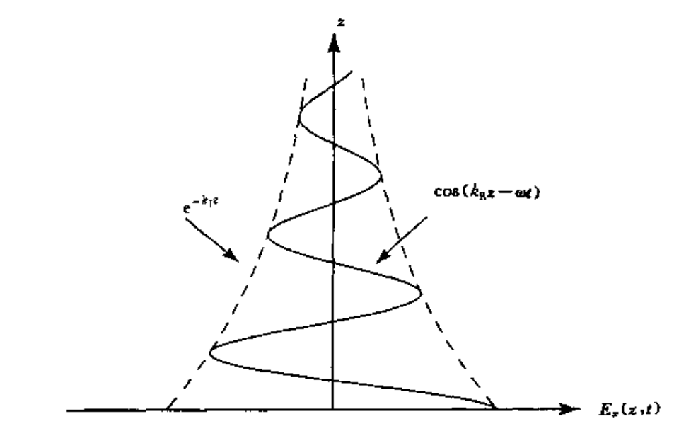

# 介质中的波

## 导电介质中的波

导电介质
$$ \begin{align}
        \nabla \times \vec{E} &= -\mu \frac{\partial}{\partial t} \vec{H} \\
        \nabla \times \vec{H} &= \varepsilon \frac{\partial}{\partial t} \vec{E} + \sigma \vec{E}
\end{align}$$

为了导出电场的波动方程，对式子（1）再次求旋度

$$ \begin{aligned}
        \nabla \times \nabla \times \vec{E} = -\mu \frac{\partial}{\partial t} \nabla \times \vec{H}
\end{aligned}$$

整理可得

$$ \begin{align}
        \nabla^2 \vec{E} - \varepsilon \mu \frac{\partial^2}{\partial t^2} \vec{E} - \sigma \mu \frac{\partial}{\partial t} \vec{E} = 0
\end{align}$$

一个可能的解为$\vec{E}(\vec{r},t) = \hat{x} E_0 e^{-K_1 z}\cos{(K_R z - \omega t)}$

代回到式子（3）中可以求得$K_1$,$K_R$

$$ \begin{aligned}
        K_R &=\omega \sqrt{\mu \varepsilon} [\frac{1}{2}(\sqrt{1+\frac{\sigma^2}{\varepsilon^2 \omega^2} } +1)]^\frac{1}{2} \\
        K_1 &=\omega \sqrt{\mu \varepsilon} [\frac{1}{2}(\sqrt{1+\frac{\sigma^2}{\varepsilon^2 \omega^2}}-1)]^\frac{1}{2}
\end{aligned}$$

---

**已知电场求磁场**：利用**旋度公式**

$$ \begin{align}
        (\frac{\partial E_z}{\partial y} - \frac{\partial E_y}{\partial z})\hat{x} + (\frac{\partial E_x}{\partial z} - \frac{\partial E_z}{\partial x})\hat{y} + (\frac{\partial E_y}{\partial x} - \frac{\partial E_x}{\partial y}) \hat{z} = -\mu \frac{\partial}{\partial t} \vec{H}
\end{align}$$

由于电场只有$E_x$分量，最后可得$\frac{\partial E_x}{\partial z} = -\mu \frac{\partial}{\partial t} H_y$

$$ \begin{align}
        H_y = \hat{y} \frac{E_0 e^{-K_1 z}}{\omega \mu} \left [ -K_1 \sin(K_R z - \omega t) + K_R\cos(K_R z - \omega t) \right]
\end{align}$$

---

定义穿透深度为$d_p = \frac{1}{K_1}$

高电导率的情况下$d_p = \sqrt{\frac{2}{\omega \sigma \varepsilon}}$
低导电率的情况下$d_p = \frac{2}{\sigma} \sqrt{\frac{\varepsilon}{\mu}}$，这是一个与频率无关的数

---

## 等离子中的波

等离子体中的体电流密度$J_p$
$$ \begin{align}
        J_p = Nqv
\end{align}$$
N为电荷的体密度

利用mawxell方程组可以得到
$$ \begin{align}
        (\nabla^2 - \mu_0\varepsilon_0 \frac{\partial^2}{\partial t^2}- \frac{\mu_0 N q^2}{mu})\vec{E} = 0
\end{align}$$

将一个可能的解带入
$$ \begin{align}
        \vec{E}(z,t) = \hat{x} E_0 e^{-K_I z}\cos (K_R z - \omega t)
\end{align}$$

得到等离子体中的色散关系
$$ \begin{align}
        \begin{cases}
                 K_R^2 - K_I^2 &= \omega^2 \mu_0 \varepsilon_0(1-\frac{\omega_p^2}{\operatorname{\omega^2}})    \\
                        2K_RK_I &=0
        \end{cases}
\end{align} $$
$\omega_p$为等离子频率，$\omega_p = \sqrt{\frac{Nq^2}{m\varepsilon_0}}$
当$\omega \gt \omega_p$时

$$ \begin{align}
        \begin{cases}
                K_R^2 = \omega^2 \mu_0 \varepsilon_0 (1-\frac{\omega_p^2}{\omega^2}) \\
                K_I = 0
        \end{cases}
\end{align}$$

当$\omega \lt \omega_p$
$$ \begin{align}
        \begin{cases}
                K_R = 0 \\
                K_I^2 = \omega^2 \mu_0 \varepsilon_0 (1-\frac{\omega_p^2}{\omega^2}) 
        \end{cases}
\end{align}$$

这是一个凋落波，电磁波沿传播方向指数衰减，且不传播时间平均的波

---
在色散介质中，k时$\omega$的非线性函数，色散关系就是空间频率k与时间频率$\omega$的关系
在等离子体中
$$ K_R(\omega) = \frac{1}{c} \sqrt{\omega^2 - \omega_p^2} $$

现考虑两个空间频率非常相近的波，$\omega_1 = \omega_0 + \delta \omega$, $\omega_2 = \omega_0 - \delta \omega$，其空间频率有$K_{R1} = K_{R0} + \delta K_R$, $K_{R2} = K_{R0} - \delta K_R$
合成后的电场为
$$ \begin{align}
        E(z,t) = 2\cos (K_{R0} z - \omega_0 t) \cos(\delta K_R z - \delta \omega t)
\end{align}$$

前一个余弦函数可以确定相速度（等相面移动的速度）
$$ \begin{align}
        v_p = \frac{\omega}{K_R}
\end{align}$$

后一个余弦函数可以确定群速度，即包络移动的速度，后一个余弦函数达到了频率调制的作用。
$$ \begin{align}
        v_g = \frac{\delta \omega}{\delta K_R}
\end{align}$$