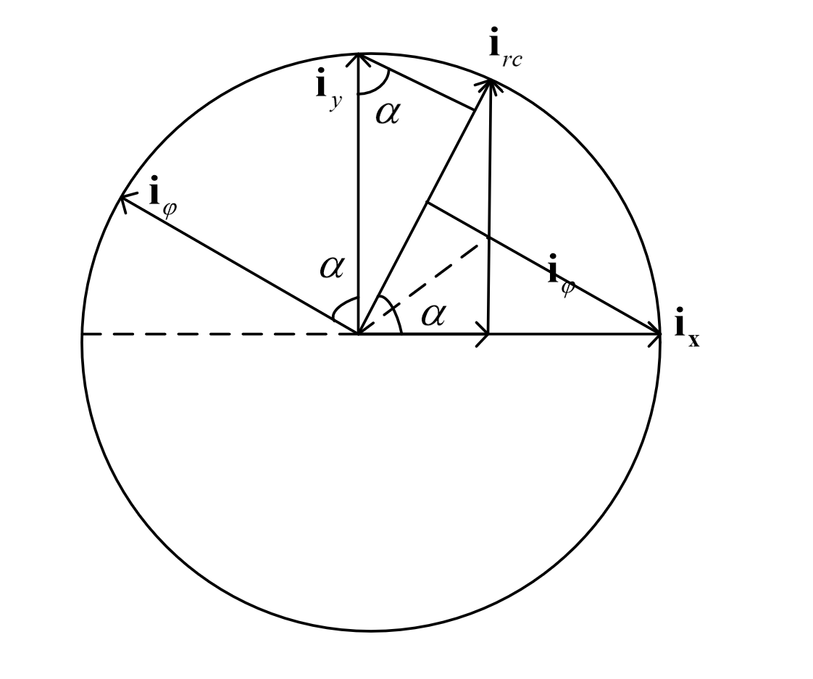
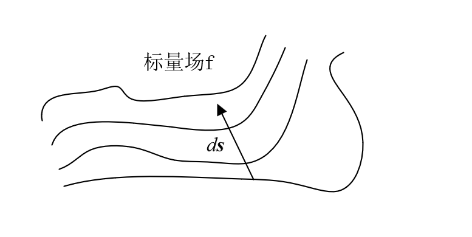

# 场论相关的数学知识

## 正交曲线坐标系

:star:常见的正交坐标系有直角坐标系，柱坐标系，球面坐标系
在直角坐标系中
$$ \begin{cases}
    h_1 = h_x =1 \\
    h_2 = h_y = 1 \\
    h_3 = h_z = 1
\end{cases} \quad 
    \begin{cases}
        \partial u_1 = \partial x \\
        \partial u_2 = \partial y \\
        \partial u_3 = \partial z 
    \end{cases} \quad
    \begin{cases}
        \boldsymbol{i_1} = \boldsymbol{i_x} \\
        \boldsymbol{i_2} = \boldsymbol{i_y} \\
        \boldsymbol{i_3} = \boldsymbol{i_z} \\
    \end{cases}$$

在柱坐标系中
$$ \begin{cases}
    h_1 = h_{rc} =1 \\
    h_2 = h_\varphi = r_c \\
    h_3 = h_z = 1
\end{cases} \quad 
    \begin{cases}
        \partial u_1 = \partial r_c \\
        \partial u_2 = \partial \varphi \\
        \partial u_3 = \partial z 
    \end{cases} \quad
    \begin{cases}
        \boldsymbol{i_1} = \boldsymbol{i_{rc}} \\
        \boldsymbol{i_2} = \boldsymbol{i_\varphi} \\
        \boldsymbol{i_3} = \boldsymbol{i_z} \\
    \end{cases}$$
在球面坐标系中
$$ \begin{cases}
    h_1 = h_{rs} =1 \\
    h_2 = h_\theta = r_s \\
    h_3 = h_\varphi = r_s\sin \theta
\end{cases} \quad 
    \begin{cases}
        \partial u_1 = \partial r_s \\
        \partial u_2 = \partial \theta \\
        \partial u_3 = \partial \varPhi 
    \end{cases} \quad
    \begin{cases}
        \boldsymbol{i_1} = \boldsymbol{i_{rs}} \\
        \boldsymbol{i_2} = \boldsymbol{i_\theta} \\
        \boldsymbol{i_3} = \boldsymbol{i_\varphi} \\
    \end{cases}$$

失径：有坐标原点指向空间任意一点P的矢量线段称为P点的位置失或失径
直角坐标系中的失径：$\boldsymbol{r} = \boldsymbol{i_x}x + \boldsymbol{i_y}y + \boldsymbol{i_z}z$
柱坐标系中的失径：$\boldsymbol{r} = \boldsymbol{i_{rc}}r_c + \boldsymbol{i_z}z$
球面坐标系中的失径：$\boldsymbol{r} = \boldsymbol{i_{rs}}r_s$

## 矢量线元在广义坐标系中的表达
$d\boldsymbol{s} = \boldsymbol{i_1}ds_1 +\boldsymbol{i_2}ds_2 + \boldsymbol{i_3}ds_3$，直角坐标系中的弧微分$ds = \sqrt{dx^2 + dy^2 + dz^2}$
$$ \begin{cases}
    u_1 = u_1(x,y,z) \\
    u_2 = u_2(x,y,z) \\
    u_3 = u_3(x,y,z) 
\end{cases} \Leftrightarrow 
 \begin{cases}
    x = x(u_1,u_2,u_3) \\
    y = y(u_1,u_2,u_3) \\
    z = z(u_1,u_2,u_3)
 \end{cases}$$

$$ \begin{cases}
    dx = \frac{\partial x}{\partial u_1}du_1 + \frac{\partial x}{\partial u_2}du_2 + \frac{\partial x}{\partial u_3}du_3 \\
    dy = \frac{\partial y}{\partial u_1}du_1 + \frac{\partial y}{\partial u_2}du_2 + \frac{\partial y}{\partial u_3}du_3 \\
    dz = \frac{\partial z}{\partial u_1}du_1 + \frac{\partial z}{\partial u_2}du_2 + \frac{\partial z}{\partial u_3}du_3 \\
\end{cases} $$

将$ds$分解到三个方向，比如分解到$dx$方向上时，$dy,dz$保持不变，故
$$ \begin{cases}
    ds_1 = \sqrt{dx^2 + dy^2 + dz^2} = \sqrt{(\frac{\partial x}{u_1})^2 + (\frac{\partial y}{u_1})^2 +(\frac{\partial z}{u_1})^2}du_1 =h_1du_1\\
    ds_2 = \sqrt{dx^2 + dy^2 + dz^2} = \sqrt{(\frac{\partial x}{u_2})^2 + (\frac{\partial y}{u_2})^2 +(\frac{\partial z}{u_2})^2}du_2=h_2du_2 \\
    ds_3 = \sqrt{dx^2 + dy^2 + dz^2} = \sqrt{(\frac{\partial x}{u_3})^2 + (\frac{\partial y}{u_3})^2 +(\frac{\partial z}{u_3})^2}du_3=h_3du_3 \\
\end{cases} $$
上式中，$h_i$称为拉梅系数，$h_i$是$u_1,u_2,u_3$的函数

直角坐标系中：$d\boldsymbol{s} = \boldsymbol{i_x}dx + \boldsymbol{i_y}dy + \boldsymbol{i_z}dz$
柱坐标系中：$d\boldsymbol{s} = \boldsymbol{i_{rc}}dr_c + \boldsymbol{i_\varphi}r_cd\varphi + \boldsymbol{i_z}dz$
球坐标系中：$d\boldsymbol{s} = \boldsymbol{i_{rs}}dr_s +\boldsymbol{i_\theta} r_sd\theta + \boldsymbol{i_\varphi}r_s \sin \theta d\varphi$

## 矢量面元的表达式
$$ \begin{align*}
    d\boldsymbol{a} &= \boldsymbol{i_1}da_1 + \boldsymbol{i_2}da_2 + \boldsymbol{i_3}da_3 \\
    &= \boldsymbol{i_1}ds_2ds_3 + \boldsymbol{i_2}ds_3ds_1 + \boldsymbol{i_3}ds_1ds_2 \\
    &=\boldsymbol{i_1}h_2h_3du_1du_2 + \boldsymbol{i_2}h_3h_1du_3du_1 + \boldsymbol{i_3}h_1h_2du_1du_2
\end{align*} $$
直角坐标系中表达：$d\boldsymbol{a} = \boldsymbol{i_x}dydz + \boldsymbol{i_y}dzdx + \boldsymbol{i_z}dxdy$
柱坐标系中表达：$d\boldsymbol{a} = \boldsymbol{i_{rc}}r_cd\varphi dz + \boldsymbol{i_\varphi}dzd_{rc} + \boldsymbol{i_z}r_cdr_cd\varphi$
球坐标中表达：$d\boldsymbol{a} = \boldsymbol{i_{rs}}r_s^2 \sin \theta d\theta d\varphi + \boldsymbol{i_\theta} r_s\sin \theta d\varphi dr_s + \boldsymbol{i_\varphi}r_sd_{rs}d\theta$

## 体元的表达式子
$$ \begin{align*}
    dV &= ds_1ds_2ds_3 \\
    &= h_1h_2h_3du_1du_2du_3
\end{align*} $$

直角坐标系：$dV = dxdydz$
柱坐标系：$dV = r_cd_{rc}d\varphi dz$
球坐标系：$dV = r_s^2 \sin \theta dr_s d\theta d\varphi$

## 直角坐标系与柱坐标系的转换
$$ \begin{align*}
    r_c = \sqrt{x^2 + y^2}  &| x =r_c \cos \varphi \\
    \varphi = \arctan(\frac{y}{x}) &| y = r_c \sin \varphi \\
    z=z &| z=z
\end{align*} $$

由上图可知，矢量线元之间的相互表达为
$$\begin{cases} \begin{align*}
    \boldsymbol{i_{rc}} &= \boldsymbol{i_x} \cos \varphi + \boldsymbol{i_y} \sin \varphi  \\
    \boldsymbol{i_\varphi} &= -\boldsymbol{i_x} \sin \varphi + \boldsymbol{i_y} \cos \varphi \\
    \boldsymbol{i_z} &= \boldsymbol{i_z}
\end{align*} \end{cases}  \Leftrightarrow \begin{bmatrix}
    \boldsymbol{i_{rc}} \\
    \boldsymbol{i_\varphi} \\
    \boldsymbol{i_z} 
\end{bmatrix} = \begin{bmatrix}
    \cos \varphi & -\sin \varphi & 0\\
    \sin \varphi & \cos \varphi & 0\\
    0 & 0 & 1
\end{bmatrix} \begin{bmatrix}
    \boldsymbol{i_x} \\
    \boldsymbol{i_y} \\
    \boldsymbol{i_z} 
\end{bmatrix}$$

反过来的话就是求一个逆矩阵
$$  \begin{bmatrix}
    \boldsymbol{i_x} \\
    \boldsymbol{i_y} \\
    \boldsymbol{i_z} 
\end{bmatrix} = \begin{bmatrix}
    \cos \varphi & \sin \varphi & 0\\
    -\sin \varphi & \cos \varphi & 0\\
    0 & 0 & 1
\end{bmatrix} \begin{bmatrix}
    \boldsymbol{i_{rc}} \\
    \boldsymbol{i_\varphi} \\
    \boldsymbol{i_z} \end{bmatrix}
$$

## 直角坐标系与球坐标系的转换
$$ \begin{cases}
    \begin{align*}
        r_s = \sqrt{x^2 + y^2 + z^2} &| x = r_s \sin \theta \cos \varphi \\
        \theta = \arctan \frac{\sqrt{x^2 + y^2}}{z^2} &| y = r_s \sin \theta \sin \varphi \\
        \varphi = \arctan \frac{y}{x} &| z = r_s \cos \theta
    \end{align*}
\end{cases} $$

此时，通过作图来看单位矢量之间的转换关系对我而言已经十分困难了，不妨换一种思路
在球坐标系下，对应的单位向量表示为
$$ \begin{align*}
    &\boldsymbol{i_{rs}} = (1, \theta, \varphi) \\
    &\boldsymbol{i_\theta} = (1, \theta + \frac{\pi}{2}, \varphi) \\
    &\boldsymbol{i_\varphi} = (1, \frac{\pi}{2}, \varphi + \frac{\pi}{2})
\end{align*} $$
在直角坐标系下对应为
$$ \begin{align*}
    (\sin \theta \cos \varphi, \sin \theta \sin \varphi, \cos \theta) \\
    (\cos \theta \cos \varphi, \cos \theta \sin \varphi, -\sin \theta) \\
    (-\sin \varphi, \cos \varphi, 0)
\end{align*} $$

故
$$ \begin{bmatrix}
    \boldsymbol{i_{rs}} \\
    \boldsymbol{i_\theta} \\
    \boldsymbol{i_\varphi} \\
\end{bmatrix} = 
\begin{bmatrix}
    \sin \theta \cos \varphi& \sin \theta \sin \varphi& \cos \theta \\
    \cos \theta \cos \varphi& \cos \theta \sin \varphi& -\sin \theta \\
    -\sin \varphi & \cos \varphi & 0
\end{bmatrix}
\begin{bmatrix}
    \boldsymbol{i_x} \\
    \boldsymbol{i_y} \\
    \boldsymbol{i_z}
\end{bmatrix}$$
求逆矩阵便可以得到反过来的结果
$$\begin{bmatrix}
    \boldsymbol{i_x} \\
    \boldsymbol{i_y} \\
    \boldsymbol{i_z}
\end{bmatrix} = 
\begin{bmatrix}
    \sin \theta \cos \varphi & \cos \theta \cos \varphi & -sin \varphi \\
    \sin \theta \cos \varphi & \cos \theta \sin \varphi & \cos \varphi \\
    \cos \theta & -\sin \theta & 0
\end{bmatrix}
\begin{bmatrix}
    \boldsymbol{i_{rs}} \\
    \boldsymbol{i_\theta} \\
    \boldsymbol{i_\varphi} \\
\end{bmatrix}
$$

## 梯度

**位移的方向余弦和单位矢量**
$$ \begin{align*}
    d \boldsymbol{s} &= \boldsymbol{i_1}ds_1 + \boldsymbol{i_2}ds_2 + \boldsymbol{i_3}ds_3 \\
    &= \boldsymbol{i_1}h_1 du_1 + \boldsymbol{i_2} h_2 du_2 + \boldsymbol{i_3} du_3
\end{align*} $$

单位方向矢量$d\boldsymbol{s^0}$
$$ \begin{align*}
    d\boldsymbol{s^0} = \frac{d\boldsymbol{s}}{ds} &=\boldsymbol{i_1} \frac{ds_1}{ds} + \boldsymbol{i_2} \frac{ds_2}{ds} + \boldsymbol{i_3} \frac{ds_3}{ds} \\
    & = \boldsymbol{i_1} \cos \alpha + \boldsymbol{i_2} \cos \beta + \boldsymbol{i_3} \cos \gamma
\end{align*} $$

**方向导数**

定义：标量场$f$在$d\boldsymbol{s}$方向上的变化量是$df$，$\frac{df}{ds}$即为标量场$f$在$d\boldsymbol{s}$上的方向导数

公式推导：
$$ \begin{align*}
    df &= \frac{\partial f}{\partial u_1}du_1 +\frac{\partial f}{\partial u_2}du_2 +  \frac{\partial f}{\partial u_3}du_3 \\
    \frac{df}{ds} &= \frac{\partial f}{\partial u_1}\frac{du_1}{ds} +\frac{\partial f}{\partial u_2}\frac{du_2}{ds} +  \frac{\partial f}{\partial u_3}\frac{du_3}{ds} 
\end{align*} $$

**由方向导数过度到梯度**
标量场的梯度：方向导数描述了标量场$f$在$d\boldsymbol{s}$方向上的变化情况，现在需要描述标量场$f$在各个方向上的变化情况

$$ \begin{align*}
    \frac{df}{ds} &= \frac{\partial f}{h_1\partial u_1}\frac{h_1du_1}{ds} +\frac{\partial f}{h_2\partial u_2}\frac{h_2du_2}{ds} +  \frac{\partial f}{h_3\partial u_3}\frac{h_3du_3}{ds} \\
    &= \frac{\partial f}{h_1\partial u_1}\frac{ds_1}{ds} +\frac{\partial f}{h_2\partial u_2}\frac{ds_2}{ds} +  \frac{\partial f}{h_3\partial u_3}\frac{ds_3}{ds} \\
    &=\frac{\partial f}{h_1\partial u_1}\cos \alpha +\frac{\partial f}{h_2\partial u_2} \cos \beta+  \frac{\partial f}{h_3\partial u_3}\cos \gamma \\
    &= (\boldsymbol{i_1}\frac{\partial f}{h_1\partial u_1} + \boldsymbol{i_2}\frac{\partial f}{h_2\partial u_2} + \boldsymbol{i_3}\frac{\partial f}{h_3\partial u_3}) (\boldsymbol{i_1}\cos \alpha + \boldsymbol{i_2} \cos \beta + \boldsymbol{i_3} \cos \gamma)
\end{align*} $$
$\boldsymbol{i_1}\frac{\partial f}{h_1\partial u_1} + \boldsymbol{i_2}\frac{\partial f}{h_2\partial u_2} + \boldsymbol{i_3}\frac{\partial f}{h_3\partial u_3}$ 即为梯度，由此可见，所谓方向导数，就是梯度在$d\boldsymbol{s}$方向上的投影

**梯度的一些性质**
1. 一个标量场的梯度构成一个矢量场
2. 在空间任意一点，标量场梯度的方向总是与过这点的等值面垂直的
3. 在空间任一点，标量场梯度的模值都等于标量场在该点方向导数可能取得的最大值
4. 空间任意一点，标量场梯度的方向都是指向标量场场量增加的方向
5. 一个单值标量场梯度的线积分$\int_c \nabla f \cdot d\boldsymbol{s}$仅与曲线的起止点有关