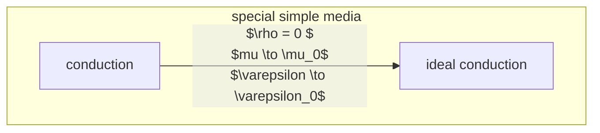

## 本构关系和欧姆定律

给出一般物质中，电磁场定律的三条独立方程
$$ \begin{cases}
    \begin{aligned}
        &\nabla \times \vec{E} = -\frac{\partial \vec{B}}{\partial t} \\
        &\nabla \times \vec{H} =  \frac{\partial \vec{D}}{\partial t} + \vec{J_f} \\
        &\nabla \cdot \vec{J_f} =  -\frac{\partial \rho_f}{\partial t}
    \end{aligned}
\end{cases} $$

the $\vec{E}$ and $\vec{B}$ here is added from outside(外加场)
$$ \begin{cases}
    \begin{aligned}
    \vec{D} &= \varepsilon_0\vec{E} + \vec{P}(\vec{E},\vec{H}) \\
    \vec{B} &= \mu_0 \vec{H} + \mu_0 \vec{M}(\vec{E}, \vec{B}) 
    \end{aligned}
\end{cases}$$

the more general constitutive relations(本构关系) are
$$ \begin{cases}
    \begin{aligned}
        \vec{D} = \vec{D}(\vec{E},\vec{B}) \\
        \vec{B} = \vec{B}( \vec{E}, \vec{B} ) \\
        \vec{J_f} = \vec{J_c}(\vec{E},\vec{B}) 
    \end{aligned}
\end{cases}$$
three equations given above do not consider extra source(不考虑外加源，仅有传导电流)

## classification of medias

the define of homogeneous: $\varepsilon,\mu,\sigma$ are not the functions of space variables

define of isotropic: $\varepsilon,\mu,\sigma$ are independent of directions(scalars)(标量)

definition of linear: $\varepsilon,\mu,\sigma$ are independent of $\vec{E}$ & $\vec{H}$

## simle media
define of simple media: **isotropic**(各项同性); polarization, magnetization, conduction are all linear

the define of homogeneous: $\varepsilon,\mu,\sigma$ are not the functions of space variables

define of isotropic: $\varepsilon,\mu,\sigma$ are independent of directions(scalars)(标量)

definition of linear: $\varepsilon,\mu,\sigma$ are independent of $\vec{E}$ & $\vec{H}$

:cry: I want to use mermaid to make the classification of sigma media more explicit, but it seems don't support latex, so i decide to postphone it.

**simple media**:similar definition to simple media, but we can ignore its conductive current. so $\vec{P}$ and $\vec{E}$ has the same direction, proportional to size(大小成正比), $\vec{M}$ and $\vec{B}$ has the same direction, proportional to size(大小成正比)
$$ \begin{cases}
    \begin{aligned}
        \vec{P} = \varepsilon_0 \chi_e \vec{E} \\
        \vec{M} = \chi_m \vec{H}
    \end{aligned}
\end{cases}$$

In the eq above, $\chi_e$ represents the rate of polarization, $\chi_m$ represents the rate of magnetization.Then
$$ \begin{align}
    \vec{D} &= \varepsilon_0\vec{E} +\varepsilon_0 \chi_e \vec{E} = \varepsilon_0(1 + \chi_e)\vec{E} = \varepsilon \vec{E} \\
    \vec{B} &= \mu_0\vec{H} + \mu_0\chi_m \vec{H} = \mu_0(1 + \chi_m)\vec{H} = \mu\vec{H} \\
\end{align} $$

### generalized linear media

if the response of polarization, magnetization, conduction is not real time, it can relate to the deriavatives of $\vec{E}$ & $\vec{B}$ with respect to time.
$$ \begin{aligned}
        \vec{D} &= \varepsilon \vec{E} + \varepsilon_1 \frac{\partial \vec{E}}{\partial t} + \varepsilon_2 \frac{\partial^2 \vec{E}}{\partial t^2} + \cdots \\
        \vec{B} &= \mu \vec{H} + \mu_1 \frac{\partial \vec{H}}{\partial t} + \mu_2 \frac{\partial^2 \vec{H}}{\partial t^2} + \cdots \\
\end{aligned}$$

## complex electromagnetic parameters
### complex electromagnetic parameters in homogeneous and conductive simple media
maxwell eq in complex form of simple media
$$ \begin{aligned}
        \nabla \times \vec{E} &= -j \omega\mu \vec{H} \\
        \nabla \times \vec{H} &= j \omega \varepsilon \vec{E} + \vec{J_f} \\
        \nabla \cdot \varepsilon \vec{E} &= \rho_f \\
        \nabla \cdot \varepsilon \vec{H} &= 0
\end{aligned}$$

for **ideal medium** with no extra source
$$ \begin{aligned}
        \rho_f = 0 \\
        \vec{J_f} = 0
\end{aligned}$$

maxwell eq:
$$ \begin{aligned}
        \nabla \times \vec{E} &= -j \omega\mu \vec{H} \\
        \nabla \times \vec{H} &= j \omega \varepsilon \vec{E}  \\
        \nabla \cdot \varepsilon \vec{E} &= 0\\
        \nabla \cdot \varepsilon \vec{H} &= 0
\end{aligned}$$

for **simple conductive media** with no extra source:
$$ \begin{aligned}
        \vec{J_f} &= \sigma \vec{E} \\
        \nabla \cdot \vec{J_f} &= -j \omega \rho_f
\end{aligned}$$

we can derive the function:
$\rho_f = -\frac{\nabla \cdot \sigma \vec{E}}{j \omega}$

maxwell eq :
$$ \begin{aligned}
        \nabla \times \vec{E} &= -j \omega\mu \vec{H} \\
        \nabla \times \vec{H} &= j \omega \varepsilon \vec{E} + \sigma \vec{E} \\
        \nabla \cdot \varepsilon \vec{E} &=  -\frac{\nabla \cdot \sigma \vec{E}}{j \omega}\\
        \nabla \cdot \varepsilon \vec{H} &= 0
\end{aligned}$$

for curl eq in maxwell's eqs:
        $\nabla \times \vec{H} = j \omega \varepsilon \vec{E} + \sigma \vec{E} = jw(\varepsilon + \frac{\sigma}{j \omega})\vec{E}$ 

$\dot{\varepsilon} = \varepsilon + \frac{\sigma}{j \omega}$