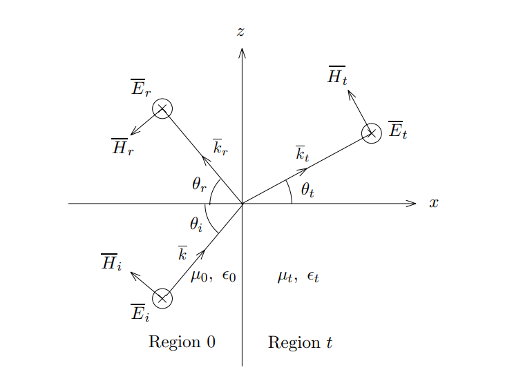

# 电磁波的反射和透射

1. **入射面**的确定：入射面由分界面的法线和波矢量$\vec{K}$共同确定，由此可见，入射面与观测的角度有关

2. TE波和TM波的确定：电场方向垂直与入射面的波称为TE波，磁场方向垂直于入射面的波成为TM波

**反射和透射问题的关键在于往哪儿反射，往哪儿透射，反射了多少，透射了多少**

TE波的反射和透射如下图所示

假设入射的电场矢量的振幅为1，写出如下的入射电场表达式
$$ \begin{align}
        \vec{E}(r,t) = \hat{y}\cos (k_x x + k_z z - \omega t)
\end{align}$$

根据法拉第电磁感应定律，将电场的旋度表达式展开，可以得到入射的磁场
$$ \begin{align}
        \vec{H}(r,t) = -\frac{k_z}{\omega \mu_0} \cos (k_x x + k_z z - \omega t)\hat{x} + \frac{k_z}{\omega \mu_0} \cos (k_x x + k_z z - \omega t) \hat{z}
\end{align}$$

写出反射电场和反射磁场，R为反射系数
$$ \begin{align}
        E_{ry} &= R \cos (-k_{rx}x + k_{rz}z - \omega t) \\
        H_{rx} &= -\frac{k_{rz}}{ \omega \mu_0} R\cos (-k_{rx}x + k_{rz}z - \omega t) \\
        H_{rz} &= -\frac{k_{rx}}{ \omega \mu_0} R\cos (-k_{rx}x + k_{rz}z - \omega t)
\end{align}$$

写出透射电场于透射磁场，T为透射系数
$$ \begin{align}
        E_{ty} &= T \cos (k_{tx}x + k_{tz}z - \omega t) \\
        H_{tx} &= -\frac{k_{tz}}{ \omega \mu_0} T\cos (k_{tx}x + k_{tz}z - \omega t) \\
        H_{tz} &= \frac{k_{tx}}{ \omega \mu_0} T\cos (k_{tx}x + k_{tz}z - \omega t)
\end{align}$$

根据边界条件可以知道，在边界上，电场和磁场的切向分量都连续，可以根据边界条件求出R，T
$$ \begin{align}
        E_y + E_{ry} &= E_{ty} \\
        H_z + H_{rz} &= H_{tz}
\end{align}$$

式子9和式子10在x=0处对任意z都成立，得到
$$ \begin{align}
        kz = k_{rz} &= k_{tz} \\
        1 + R &= T \\
        \frac{k_x}{\mu_0} (1-R) &= \frac{k_{tx}}{\mu_t}T
\end{align}$$
整理后得
$$ \begin{align}
        P = P_{0t}^{TE} &= \frac{\mu_0 k_{tx}}{\mu_t k_x} \\
        R &= \frac{1-P}{1+P} \\
        T &= \frac{2}{1+P}
\end{align}$$