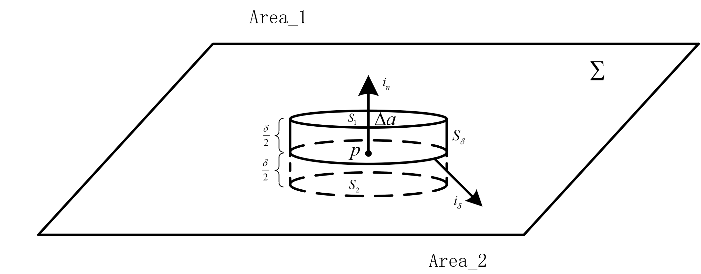

# 法向边界条件

如图所示，针对$\Sigma$平面上的一点$P$作如图所示的圆柱面，圆柱面$S$由三个部分组成
$$ S = S_1 + S_2 + S_\delta $$
计算电场强度$E$在圆柱面$S$上的面积分
$$ \begin{align*}
    \oint_S \varepsilon_0 \boldsymbol{E}_1 \cdot d \boldsymbol{a} &= \int_{S_1}
\end{align*} $$
