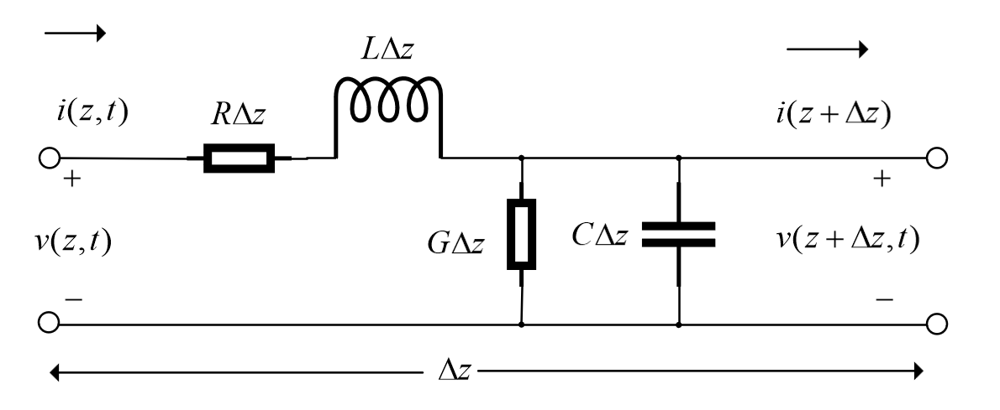

## 传输线理论

$$ \begin{align}
    v(z,t)-i(z,t)R\Delta z - L\Delta z\frac{\partial i(z,t)}{\partial t} - v(z+\Delta z,t) = 0 \\
    i(z,t) - v(z+\Delta z,t) G \Delta z - C \Delta z \frac{\partial v(z+\Delta z,t)}{\partial t} - i(z+\Delta z, t) = 0
\end{align} $$

将上面两个式子同时除以$\Delta z$并将$\Delta z \to 0$ 时可以得到下面两个式子

$$ \begin{align}
    \frac{\partial v(z,t)}{\partial z} = -R i(z,t)- L\frac{\partial i(z,t)}{\partial t} \\
    \frac{\partial i(z,t)}{\partial z} = -G v(z,t)- C\frac{\partial v(z,t)}{\partial t}  
\end{align} $$

因为在正弦稳态情况下$z$和$t$无关，可以将偏导符号简化为$d$

$$ \begin{align}
    \frac{d v(z,t)}{d z} = -R i(z,t)- L\frac{d i(z,t)}{d t} \\
    \frac{d i(z,t)}{d z} = -G v(z,t)- C\frac{d v(z,t)}{d t}  
\end{align} $$
