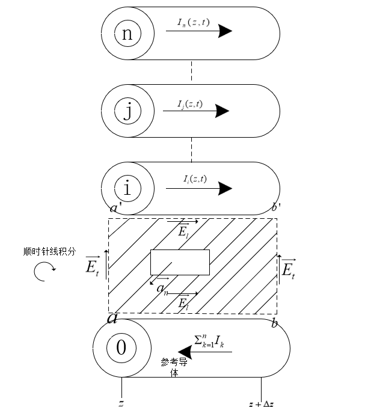

# 多导体传输线方程

## 积分形式的maxwell方程导出多导体传输线方程

总共有n+1个导体，那个1为参考导体，如下图所示

线积分方向为顺时针方向，面的法向向量如$\vec{a_n}$所示，写出法拉第电磁感应定律的积分形式，由于线积分方向和面的法向向量之间不满足右手定则，故下式右侧符号抵消
$$ \begin{align}
        \int_a^{a'}\vec{E_t}\cdot d \vec{l} +
        \int_{a'}^{b'}\vec{E_l}\cdot d \vec{l} +
        \int_{b'}^{b}\vec{E_t}\cdot d \vec{l} +
        \int_b^{a}\vec{E_l}\cdot d \vec{l} = 
        \mu \frac{d}{dt}\int_s \vec{H_t} \cdot \vec{a_n} ds
\end{align}$$

根据TEM场的特性，可以唯一确定第i个导体与参考导体之间的电压，且势能的增量为电场线积分的负值，可得
$$ \begin{align}
        V_i(z,t) = -\int_a^{a'}\vec{E_t(x,y,z,t)} \cdot d\vec{l} \\
        V_i(z+\Delta z,t) = -\int_b^{b'}\vec{E_t(x,y,z+\Delta z,t)} \cdot d\vec{l} \\
\end{align}$$

在纵向，即沿着导体的方向，电压的下降主要是由于导体的阻抗引起，可得
$$ \begin{align}
        \int_{a'}^{b'}\vec{E_l}\cdot d \vec{l} = r_i \Delta z I_i(z,t) \\
        \int_b^{a}\vec{E_l}\cdot d \vec{l} = r_0 \Delta z \Sigma_{k=1}^nI_k(z,t)
\end{align}$$
将2，3，4，5带入式子1，可得下式，（注意式子3中的积分路径与式子1中对应部分相反）
$$ \begin{align}
        -V_i(z,t) + r_i\Delta z I_i(z,t) + V_i(z+\Delta z,t) +r_0 \Delta z \Sigma_{k=1}^nI_k(z,t) = \mu \frac{d}{dt}\int_s\vec{H_t}\cdot \vec{a_n} ds
\end{align}$$

把左边的两项带电阻项移到右边，再同除Δz，可得下式
$$ \begin{align}
        \frac{V_i(z+\Delta z,t) - V_i(z,t)}{\Delta z} = -r_0 I_1 - r_0 I_2 -\cdots - (r_0 + r_i)I_i- \cdots-r_0 I_n + \mu \frac{d}{dt}\frac{1}{\Delta z}\int_s \vec{H_t}\cdot \vec{a_n}ds
\end{align}$$

产生磁通的方向与$\vec{a_n}$相反，流经参考导体的电流是n个导体产生的回路电流，产生磁通的源就是这个总的电流，可得
$$ \begin{align}
        \psi_i = -\mu \frac{1}{\Delta z} \int_s \vec{H_t} \cdot \vec{a_n}ds =l_{i1}I_1 + l_{i2}I_2 + \cdots l_{ii} + \cdots + l_{in}I_n
\end{align}$$

代入到式子7中，可以得到
$$ \begin{align}
        \frac{\partial V_i(z,t)}{\partial z} = -r_0 I_1 - r_0 I_2 -\cdots - (r_0 + r_i)I_i- \cdots-r_0 I_n -l_{i1}\frac{\partial I_1(z,t)}{\partial t} - l_{i2}\frac{\partial I_2(z,t)}{\partial t} - \cdots -l_{ii} \frac{\partial I_i(z,t)}{\partial t} - \cdots - l_{in}\frac{\partial I_n{z,t}}{\partial t}
\end{align}$$

式子太难看了，用向量形式表达，
$$ \begin{align}
        \frac{\partial}{\partial z} \boldsymbol{V}(z,t) = -\boldsymbol{R}\boldsymbol{I}(z,t) - \boldsymbol{L}\frac{\partial}{\partial t}\boldsymbol{I}(z,t)
\end{align}$$
其中，各矩阵分别为
$$ \begin{align}
        \boldsymbol{V}(z,t) = 
        \begin{bmatrix}
                V_1(z,t) \\
                \vdots \\
                V_i(z,t) \\
                \vdots \\
                V_n(z,t)
        \end{bmatrix}
\end{align}$$

$$ \begin{align}
        \boldsymbol{I}(z,t) = 
        \begin{bmatrix}
                I_1(z,t) \\
                \vdots \\
                I_i(z,t) \\
                \vdots \\
                I_n(z,t)
        \end{bmatrix}
\end{align}$$

电感矩阵为
$$ \begin{align}
        \boldsymbol{L} = 
        \begin{bmatrix}
                l_{11} & l_{12} & \cdots & l_{1n} \\
                l_{21} & l_{22} & \cdots & l_{2n} \\
                \vdots & \vdots & \ddots & \vdots \\
                l_{n1} & l_{n2} & \cdots & l_{nn}
        \end{bmatrix}
\end{align}$$

这是一个对称矩阵$l_{ij} = l_{ji}$

定义单位长度电阻矩阵R
$$ \begin{align}
        \boldsymbol{R} = 
        \begin{bmatrix}
                (r_0 + r_1) & r_0 &  \cdots & r_0 \\
                r_0 & (r_0 + r_2) & \cdots & r_0 \\
                \vdots & \vdots & \ddots & \vdots \\
                r_0 & r_0 & \cdots & (r_0 + r_n)
        \end{bmatrix}
\end{align}$$
**式子14仅适用于参考导体是有限尺度比如导线时的情景，在导体是很大的接地平面的情况下会有不同。**

---
另外一条公式由电荷守恒方程推出
