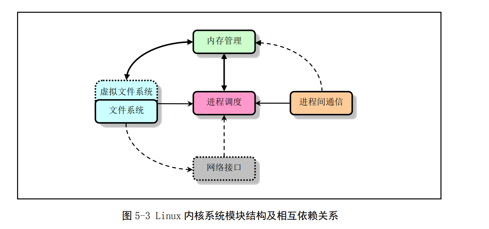

# linux 内核结构

linux 内核主要由5个部分构成，**进程调度模块**，**内存管理模块**，**文件系统模块**，**进程间通信**和**网络通信模块**

- **进程调度模块**负责控制进程对**CPU资源**的使用
- **内存管理模块**负责各个进程安全的共享主机的内存，以及虚拟内存的管理使用
- **文件系统**负责对外部设备的驱动和存储，虚拟文件系统提供统一的接口
- **进程间通信模块**负责提供进程间的多种信息交换方式
- **网络模块**负责支持各种网络协议

