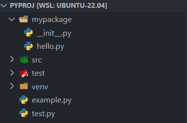

# module package 与import
based on picture



## module
- 在python中，module是一个组织单位，自己独自构成一个命名空间，实际应用中，一个module通常对应一个.py文件


## package

- package是一种特殊的module，往往对应一个文件夹，便于更好的管理结构，package中可以有subpackage，也可以有module

## import module的过程

**ep1**：一种简单的情况，只有 example.py 和 test.py，并在example.py 中import test.py

```python
# test.py
class Test
pass
```

```python
# example.py
import test
```
1. 第一步首先去检查缓存，查看缓存中是否存在名为test的module
2. 缓存中不存在的话，要去花功夫去找了
3. 先查看这个module是不是一个`buildin module`
4. 不行的话去几个文件夹中寻找可以被load成test的文件，文件夹位置由`sys.path`给出。运行example.py的话，一般会从example.py所在的文件夹开始找起，一旦找到就不再寻找。我们可以手动添加sys.path
5. 找到以后，python会在一个单独的命名空间中运行这个文件，然后把这个module object 赋值给test变量
6. 如果不想将module object 赋值给test，想另起一个变量t ，可以使用`import test as t`
7. 如果只想使用test中的某个class，可以使用`from test import Test`

## import package 的过程
- 查看package下有没有__init__.py这个文件，如果没有这个文件，python就不会运行任何代码 ，有这个文件，就会运行__init__.py这个文件
- 所以，只引入package的时候，不会加载package下的module，比如`import mypackage`，那么仍然不能使用hello.py中的内容
- 如果想要使用package下的module，得使用`import mypackage.hello`，这个时候包会被赋值给mypackage，以便直观的使用mypackage.hello。如果使用`import mypackage.hello as h` 的话，包不会被赋值给mypackage

## relative import 
**适用于需要在一个package下的不同module之间互相引用**

**ep1**:在world.py中调用hello.py中的内容
```python
# hello.py
class Hello 
    print('hello')
```

```python
# world.py
from .hello import Hello
```
:star: **单独尝试运行package下的一个module会导致relative import出错**。
报错为：
因为单独运行一个文件的时候，这个文件会被当做**main module** 给load进来，这样这个文件就不会隶属于任何一个package，导致相对路径无法转化为绝对路径