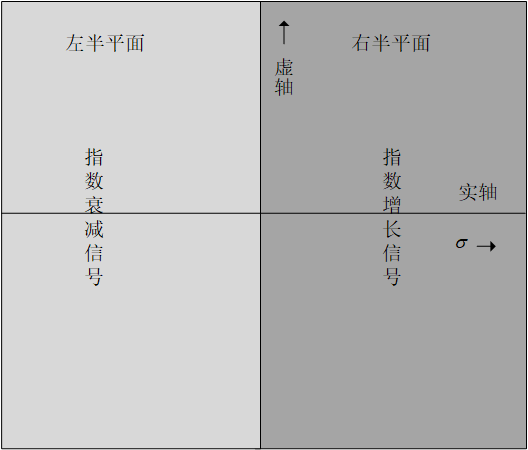

# 信号与系统的一些基本概念和定性说明

## 信号的能量以及功率
信号的能量公式：
$$ E_x = \int_{-\infty}^{\infty} \left | x(t) \right |^2 dt $$

信号的功率公式：
$$ P_x = \lim_{T \to \infty} \frac{1}{T} \int_{\frac{-T}{2}}^{\frac{T}{2}} \left | x(t) \right |^2 dt $$

可见信号功率时信号振幅平方的时间均值，也就是$x(t)$的均方值。$P_x$的开方根就是$x(t)$的**rms**（均方根）值。

**ep**求下列信号的功率和rms值

1. $x(t) = C \cos (\omega_0 t + \theta)$
$$ \begin{align*}
    P_x &= \lim_{T \to \infty} \frac{1}{T} \int_{\frac{-T}{2}}^{\frac{T}{2}} C^2 \cos ^2(\omega_0t＋ \theta) dt \\
   &= \lim_{T \to \infty} \frac{C^2}{T} \int_{\frac{-T}{2}}^{\frac{T}{2}} \frac{\cos(2\omega_0t + 2\theta) + 1}{2} dt \\
   &= \frac{C^2}{2} \\
   rms &= \sqrt{P_x} = \frac{C}{\sqrt{2}}
\end{align*}$$

2. $x(t) = C_1 \cos(\omega_1t + \theta_1) + C_2 \cos (\omega_2t + \theta2)$

$$ \begin{align*}
    P_x &= \lim_{T \to \infty} \frac{1}{T} \int_{\frac{-T}{2}}^{\frac{T}{2}} [C_1 \cos(\omega_1t + \theta_1) + C_2 \cos (\omega_2t + \theta2)]^2 dt \\
   &= \lim_{T \to \infty} \frac{1}{T}  \int_{\frac{-T}{2}}^{\frac{T}{2}} C_1^2 \cos ^2(\omega_1t + \theta) + 2C_1 \cos (\omega_1t + \theta_1) + C_2^2 \cos ^2(\omega_2t + \theta_2) \\
   &= \frac{C_1^2+ C_2^2}{2} \\
   rms &= \sqrt{P_x} = \sqrt{\frac{C_1^2+ C_2^2}{2}}
\end{align*}$$

3. $x(t) = De^{j\omega_0 t}$

$$ \begin{align*}
    P_x &= \lim_{T \to \infty} \frac{D^2}{T} \int_{\frac{-T}{2}}^{\frac{T}{2}} \left | e^{j \omega_0 t} \right |^2 dt \\ 
    &= D^2 \\
    rms &= \left | D \right |
\end{align*} $$

## 一些常用的信号模型

1. 阶跃函数
   $$ u(t)\begin{cases}
    1 \quad t \ge 0 \\
    0 \quad t \lt 0
   \end{cases} $$
    如果想让一个信号$t = 0$开始，只需要将这个信号乘$u(t)$。

2. 单位冲激函数
   函数的定义为：
   $$ \begin{align*}
    &\delta(t) = 0 \qquad t \ne 0 \\
    &\int_{-\infty}^{\infty} \delta(t) dt = 1
   \end{align*} $$

   冲击函数的重要特点不在于它的形状，而在于**其有效持续期趋近于0的同时，它的面积始终保持为1**，在实际中真正的冲激函数是不可能被产生的，它仅仅能够被趋近。

   1. 考虑函数乘以冲激
   $\phi(t) \delta(t) = \phi(0)\delta(t)$
   一个连续函数$\phi(t)$与一个位于$t = 0$的单位冲激相乘产生一个冲激，该冲激发生在$t = 0$时刻，强度为$\phi(0)$。

   2. 冲激函数的采样性质
   $\int_{-\infty}^{\infty} \phi(t) \delta(t) dt = \phi(0)\int_{-\infty}^{\infty} \delta(t) dt = \phi(0)$

   3. 作为广义函数的单位冲激
   一个常规函数是由所有时间$t$的值表征的，而冲激函数在$t = 0$这个点却没有进行定义。将冲激函数定义为一个广义函数可以解决这些问题。**一个广义函数是用他对其他函数的作用而不是某个时刻的值来定义的**，**在广义函数中用采样性质定义冲激函数**
   单位阶跃函数$u(t)$在$t=0$处不连续，在常规意义下导数不存在。而在广义函数的意义下，这个导数存在，而且它就是$\delta(t)$，下面利用分布积分证明：
   $$ \begin{align*}
    \int_{-\infty}^{\infty} \phi(t) du & = u(t) \phi(t) |_{-\infty}^{\infty} - \int_{-\infty}^{\infty}u(t)d\phi(t) \\
    & =\phi(\infty) - \int_{0}^{\infty}d\phi(t) \\ 
    & =\phi(0)
   \end{align*} $$
   这样一来：
   $$ \int_{-\infty}^{t} \delta(\tau)d \tau = u(t) $$
   所有从单位冲激函数导出的这些函数统（连续求导和积分）称为奇异函数

   4. 指数函数$e^{st}$
   在信号与系统领域，指数函数$e^{st}$是一个很重要的函数，其中$s$一般为复数，给出为：
   $$ s = \sigma + j\omega $$
   $$ e^{st} = e^{(\sigma + j \omega)t} = e^{\sigma t}e^{j \omega t} = e^{\sigma t}(\cos \omega t + j \sin \omega t) $$
   
   s虚部的绝对值是$\left | \omega \right |$，它指出$e^{st}$ 的震荡频率；实部$\sigma$给出$e^{st}$增长幅度或者衰减速率的有关信息。对于其复频率位于实轴上的信号，震荡频率为0，这些信号就是单调增长或衰减的指数信号。对于复频率位于虚轴上的信号，这些信号通常就是具有恒定幅度的正弦信号。$s = 0$通常表示一个直流信号

   5. 信号的奇偶分量
   每个信号$x(t)$都可以表示成奇分量和偶分量的和
   $$ x(t) = \frac{1}{2} \left [x(t) + x(-t) \right] + \frac{1}{2}\left [x(t) - x(-t) \right] $$

## 系统的分类

1. 线性系统的哲学思想
   当足够大的信号加在系统上的时候，几乎在实际中看到的所有系统都变成非线性。**然而，大部分非线性系统都有可能利用小信号的线性系统来近似。**为了获得一种通解，线性系统的叠加性质是一个强有力的统一手段。叠加性质（线性）大大简化了线性系统的分析。由于分解性质，能够分别求出输入的两个分量：假设输入为0可以计算零输入分量；假设零初始条件可以计算零状态分量。再者，若将输入$x(t)$表示成一些较为简单的函数之和，
   $$ x(t) = a_1x_1(t) + a_2x_2(t) + \cdots + a_mx_m(t) $$
   那么凭借线性性质响应$y(t)$给出为：

   $$ y(t) = a_1y_1(t) + a_2y_2(t) + \cdots + a_my_m(t) $$
   其中，$y_k(t)$是对输入$x_k(t)$的零状态响应。

2. 时不变与时变系统
   系统的参数不随时间改变的系统就是时不变系统，也称恒定参数系统。对于这样的系统，如输入延时$T$秒，输出也不变但会延迟$T$秒。

3. 因果与非因果系统
   因果系统中输出的值与过去和现在有关，和将来无关；也就是说，输入加上之前输出不能开始。如果响应早于输入之前，这意味着输入加上之前就知道了将来的输入并按预先知道的输入做出响应，这是非常恐怖的，也就是**非因果系统**

4. 可逆系统与不可逆系统
   一个系统$S$依照输入信号执行某种运算，如果从相应的输出$y(t)$中可以通过某一运算返回来得到输入$x(t)$，那么这个系统就是可逆的。对于一个可逆系统最基础的是对每一个输入都有唯一的输出。

   